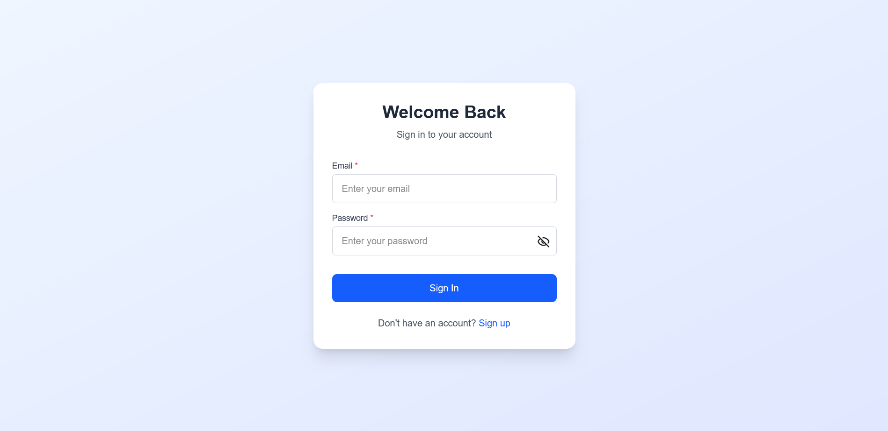
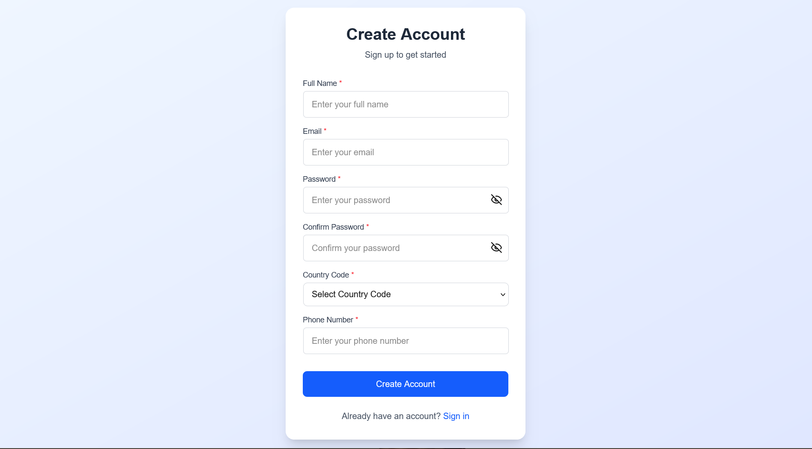
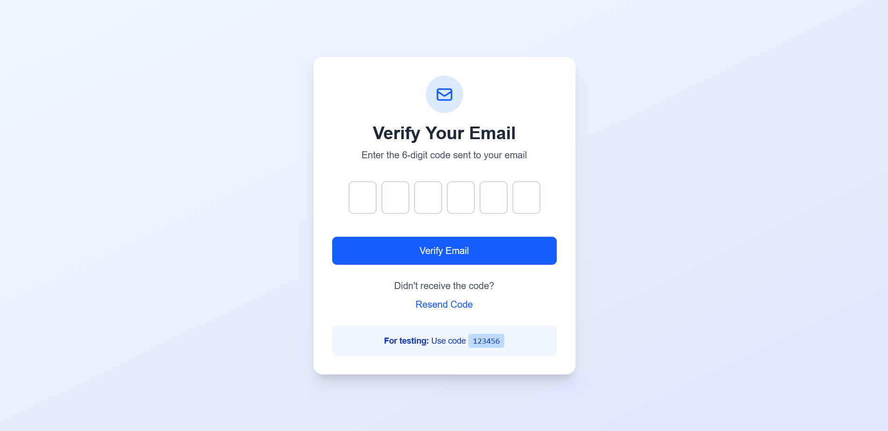
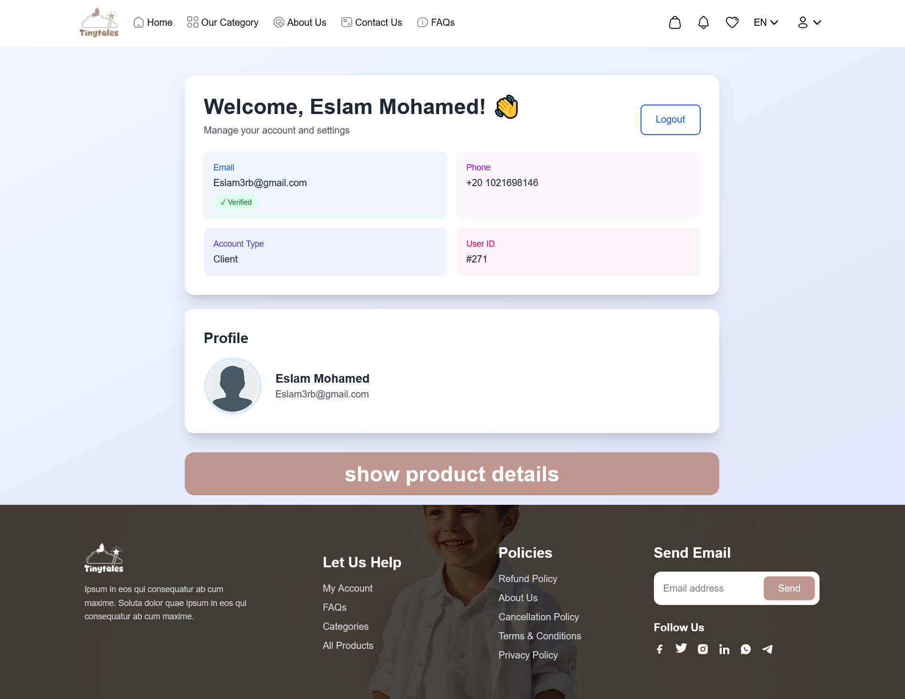
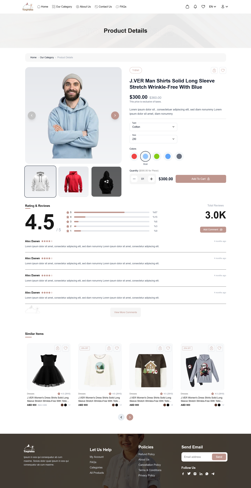
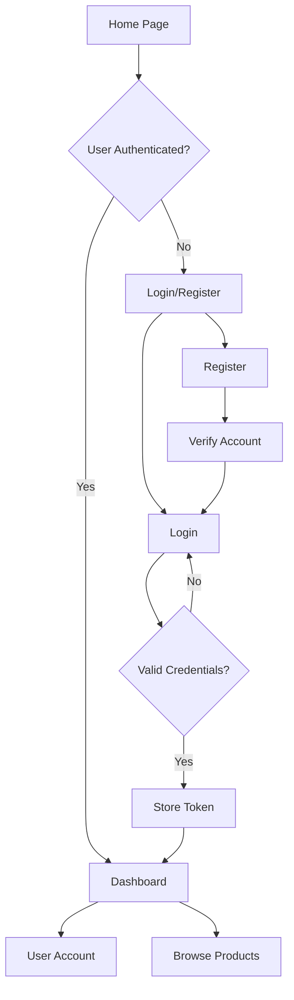

# 🚀 Next.js Authentication Dashboard

A modern, full-featured authentication system built with Next.js 16, featuring user registration, login, account verification, and a protected dashboard with product browsing capabilities.

## 📸 Preview

### Login Page


### Register Page


### Verify Account Page


### User Dashboard


### Product Page


---

## 🏗️ Project Structure

```
Frontend Task Next.js/
├── public/                      # Static assets
│   ├── icon/                   # Icon assets (22 icons)
│   ├── image/                  # General images
│   ├── preview/                # Preview screenshots
│   │   ├── preview-1.png      # Login page preview
│   │   ├── preview-2.png      # Register page preview
│   │   ├── preview-3.png      # Verify account preview
│   │   ├── preview-4.png      # Dashboard preview
│   │   └── preview-5.png      # Product page preview
│   └── products/               # Product images
│
├── src/
│   ├── app/                    # Next.js App Router
│   │   ├── (auth)/            # Authentication routes group
│   │   │   ├── login/         # Login page
│   │   │   │   └── page.js
│   │   │   ├── register/      # Registration page
│   │   │   │   └── page.js
│   │   │   └── verifyAccount/ # Account verification page
│   │   │       └── page.js
│   │   │
│   │   ├── (dashboard)/       # Dashboard routes group
│   │   │   └── userAccount/   # User account dashboard
│   │   │       └── page.js
│   │   │
│   │   ├── product/           # Product browsing page
│   │   │   └── page.js
│   │   │
│   │   ├── layout.js          # Root layout
│   │   ├── page.js            # Home page
│   │   ├── globals.css        # Global styles
│   │   └── favicon.ico        # Favicon
│   │
│   ├── components/            # Reusable components
│   │   ├── CountryCodeSelect/ # Country code selector
│   │   │   └── CountryCodeSelect.js
│   │   ├── Footer/            # Footer component
│   │   │   └── Footer.js
│   │   ├── InputField/        # Custom input field
│   │   │   └── InputField.js
│   │   ├── Navbar/            # Navigation bar
│   │   │   └── Navbar.js
│   │   ├── ProtectedRoute/    # Route protection HOC
│   │   │   └── ProtectedRoute.js
│   │   ├── SimilarItems/      # Similar items carousel
│   │   │   └── SimilarItems.js
│   │   └── SubmitButton/      # Custom submit button
│   │       └── SubmitButton.js
│   │
│   ├── contexts/              # React contexts (empty)
│   │
│   └── lib/                   # Utility functions
│       ├── api.js             # API integration utilities
│       └── auth.js            # Authentication utilities
│
├── .gitignore                 # Git ignore rules
├── eslint.config.mjs          # ESLint configuration
├── jsconfig.json              # JavaScript configuration
├── next.config.mjs            # Next.js configuration
├── package.json               # Project dependencies
├── postcss.config.mjs         # PostCSS configuration
└── README.md                  # This file
```

---

## 🎯 Features

### Authentication System
- ✅ **User Registration** - Complete signup flow with form validation
- ✅ **User Login** - Secure login with JWT token management
- ✅ **Account Verification** - Email verification system
- ✅ **Protected Routes** - Route protection using HOC pattern
- ✅ **Token Management** - Automatic token storage in localStorage

### User Interface
- 🎨 **Modern Design** - Clean, responsive UI built with Tailwind CSS v4
- 📱 **Fully Responsive** - Mobile-first design approach
- 🌐 **Country Code Selector** - International phone number support
- 🧩 **Reusable Components** - Modular component architecture

### Product Features
- 🛍️ **Product Browsing** - Browse product catalog
- 🔄 **Similar Items** - Product recommendations carousel
- 📦 **Product Details** - Detailed product information display

---

## 🛠️ Tech Stack

| Technology | Version | Purpose |
|-----------|---------|---------|
| **Next.js** | 16.1.1 | React framework with App Router |
| **React** | 19.2.3 | UI library |
| **Tailwind CSS** | ^4 | Utility-first CSS framework |
| **ESLint** | ^9 | Code linting |
| **React Compiler** | 1.0.0 | Performance optimization |

---

## 🚀 Getting Started

### Prerequisites
- Node.js 18+ installed
- npm or yarn package manager

### Installation

1. **Clone the repository**
   ```bash
   git clone <repository-url>
   cd "Frontend Task Next.js"
   ```

2. **Install dependencies**
   ```bash
   npm install
   ```

3. **Run the development server**
   ```bash
   npm run dev
   ```

4. **Open your browser**
   Navigate to [http://localhost:3000](http://localhost:3000)

### Available Scripts

```bash
npm run dev      # Start development server
npm run build    # Build for production
npm start        # Start production server
npm run lint     # Run ESLint
```

---

## 🔐 Authentication Flow



---

## 📁 Key Files Explained

### `/src/lib/api.js`
Contains API integration utilities for communicating with the backend services.

### `/src/lib/auth.js`
Handles authentication logic including token management and user session handling.

### `/src/components/ProtectedRoute/ProtectedRoute.js`
Higher-Order Component (HOC) that protects routes from unauthorized access.

### `/src/app/layout.js`
Root layout component that wraps all pages with common elements (Navbar, Footer).

### `/src/app/(auth)/`
Route group for authentication pages (login, register, verify) - shares common layout.

### `/src/app/(dashboard)/`
Route group for protected dashboard pages - requires authentication.

---

## 🎨 Styling

This project uses **Tailwind CSS v4** with PostCSS for styling:
- Custom utility classes
- Responsive design breakpoints
- Modern color palette
- Smooth animations and transitions

---

## 🔒 Route Protection

Protected routes are implemented using the `ProtectedRoute` component:
- Checks for valid authentication token in localStorage
- Redirects unauthenticated users to login page
- Maintains user session across page refreshes

---

## 📦 Component Architecture

### Reusable Components
All components follow a modular structure:
- Self-contained in their own directories
- Single responsibility principle
- Props-based configuration
- Consistent naming conventions

### Component Categories
1. **Form Components**: InputField, SubmitButton, CountryCodeSelect
2. **Layout Components**: Navbar, Footer
3. **Utility Components**: ProtectedRoute
4. **Feature Components**: SimilarItems

---

## 🌐 API Integration

The application integrates with external APIs for:
- User registration
- User authentication
- Account verification
- Product data fetching

All API calls are centralized in `/src/lib/api.js` for maintainability.

---

## 📱 Responsive Design

The application is fully responsive with breakpoints for:
- 📱 Mobile (< 640px)
- 📱 Tablet (640px - 1024px)
- 💻 Desktop (> 1024px)

---

## 🤝 Contributing

Contributions are welcome! Please follow these steps:
1. Fork the repository
2. Create a feature branch (`git checkout -b feature/AmazingFeature`)
3. Commit your changes (`git commit -m 'Add some AmazingFeature'`)
4. Push to the branch (`git push origin feature/AmazingFeature`)
5. Open a Pull Request

---

## 📄 License

This project is private and proprietary.

---

## 👨‍💻 Developer

**Eslam Mohamed**

---

## 🙏 Acknowledgments

- Next.js team for the amazing framework
- Tailwind CSS for the utility-first CSS framework
- React team for the powerful UI library

---

**Made with ❤️ using Next.js 16 and Tailwind CSS v4**
